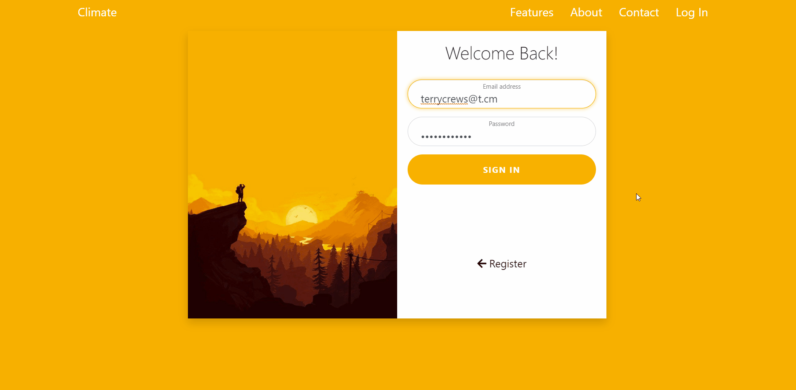
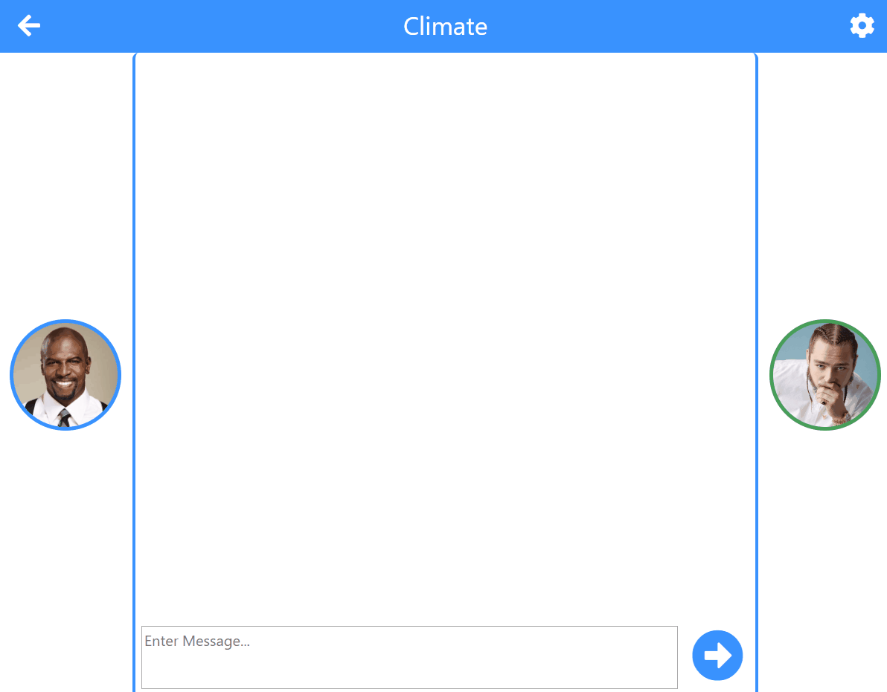

# Cimate
###### What is it?
Climate is a web app that allows users to communicate via client to client (browser to browser) connections giving them the ability to text, video and transfer files to one another. The project was part of my 2nd year Software Engineering module and was completed with another student, Andrew Dawod.

###### What were the team roles?
I was in charge of the applications design and front-end (.hbs) while Andrew worked on the back end which included integrating webRTC into the app as well as setting up the models and the database used in the project.

###### Is it functional?
Unfortunatly the applications functionality is largly incomplete due to the project being to large scale, however, you can view the prototype I built (using html, css and javascript) in the Website_Prototype folder or view the demos below.  

# Prototype Demo
##### Home/Landing 

##### Sign In/Up (pages can be clicked or pulled like below)

##### Users Home/Dashboard 

##### Text Chat 

